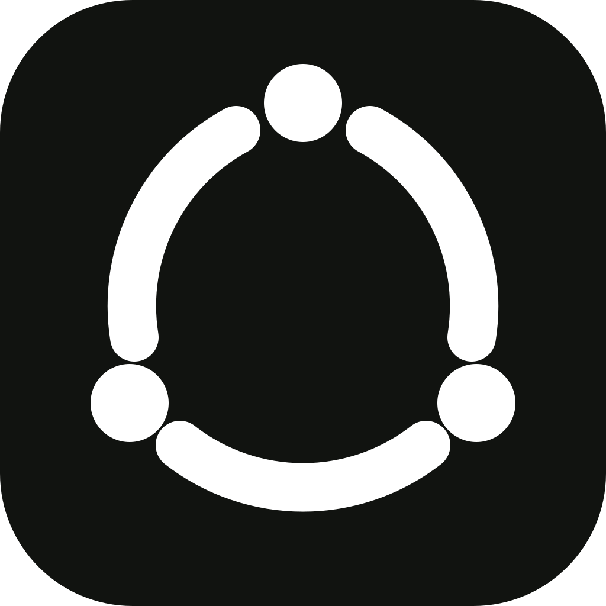

<p align="center">
  
</p>

# IDK IDE

IDK IDE is an open-source, local-first AI development workspace for Windows and the web. It combines a Monaco code editor, project explorer, terminal surface, and an AI panel that connects only to models you explicitly configure and verify.

[Open the web app](https://r-winn.github.io/IDK-IDE/) · [Download for Windows](https://github.com/r-winn/IDK-IDE/releases/latest) · [Report an issue](https://github.com/r-winn/IDK-IDE/issues)

> Preview status: model discovery, connection testing, streaming chat, appearance settings, and native updating work. Filesystem, terminal execution, Git automation, and autonomous agent tools remain visual previews and do not run commands yet.

## Windows installation

Open [Latest Release](https://github.com/r-winn/IDK-IDE/releases/latest) and choose one file:

- **`IDK.IDE_*_x64-setup.exe`** — recommended for most people. Double-click and follow the setup wizard.
- **`IDK.IDE_*_x64_en-US.msi`** — intended for IT-managed or scripted deployment.

The community installer is not code-signed yet, so Windows SmartScreen may show **Windows protected your PC**. Verify the file came from this repository, select **More info**, then **Run anyway**. A trusted code-signing certificate is required to remove that warning reliably.

After this release is installed, future updates can be downloaded from **Settings → Updates**. The app shows download progress and offers **Restart and update** when ready.

## Connect a real AI model

1. Open **Settings → AI provider**.
2. Enter an OpenAI-compatible Base URL.
3. Select **Discover models**. IDK IDE lists only models returned by that server.
4. Choose a model and select **Test model**.
5. Chat becomes available only after the test succeeds.

| Provider | Base URL | API key |
| --- | --- | --- |
| Ollama | `http://localhost:11434/v1` | Not required by default |
| LM Studio | `http://localhost:1234/v1` | Not required by default |
| Cloud provider | Provider-specific OpenAI-compatible URL | Usually required |

API keys stay in memory for the current session and are deliberately excluded from browser storage.

## Run locally

Requires Node.js 22 or newer.

```bash
git clone https://github.com/r-winn/IDK-IDE.git
cd IDK-IDE
npm install
npm run dev
```

Open `http://localhost:1420`. For a desktop development build, install the [Tauri prerequisites](https://v2.tauri.app/start/prerequisites/) and run `npm run desktop:dev`.

## Build and safety

```bash
npm run build
npm run desktop:build
```

Treat model output as untrusted: inspect generated code and never run an unfamiliar command without review. See [SECURITY.md](SECURITY.md), [CONTRIBUTING.md](CONTRIBUTING.md), and the [MIT License](LICENSE).
